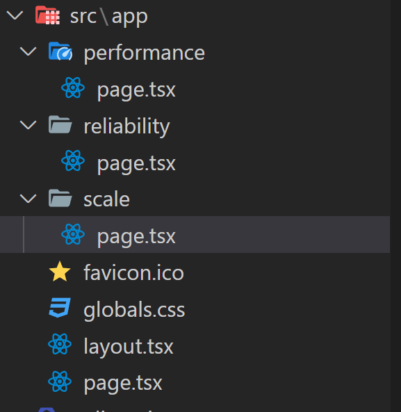

## NextJs란?

NextJs를 사용하는 이유로는 여러 가지가 존재할 수 있습니다.

예를 들어 서버사이드 렌더링 로직을 사용하고 싶을 수 있고, 하나의 프레임워크로 풀스택 애플리케이션을 구축하고 싶을 수도 있습니다.

이러한 이유도 존재하겠지만, 근본적으로 Next는 정적 사이트에 React(동적)를 사용할 수 있게 해주는 프레임워크입니다.

이를 염두하고 NextJs에 대해서 알아보려합니다.

1. 파일 기반 라우팅

NextJs는 기본적으로 파일 기반 라우팅을 채택하여 사용하고 있습니다.

즉, React의 react-router처럼 코드를 통해 페이지의 라우터를 정의하는 것이 아닌, 폴더 및 파일을 통해 라우터가 정의됩니다.

여기에는 몇가지 규칙이 존재합니다.

- app 폴더내의 page 파일은 매우 특별한 파일이며, 해당 파일이 라우터 역할을 합니다.
  - page 파일
    - export default로 내보내는 React 컴포넌트여햐 함
    - 컴포넌트명은 특별한 영향을 주지 않음 (마음대로 작명해도 괜찮음)
  - app 폴더내의 각 폴더는 해당 폴더명으로 path가 결정됩니다 - /app/dashboard → localhost:3000/dashboard - /app/dashboard/user → localhost:3000/dashboard/user
    결과적으로 아래같은 구조를 가져야합니다



- Link
  - 위에서 정의한 라우터들을 주소 입력창에 직접 입력하여 이동할 수 있겠지만, 보통 웹사이트에는 버튼등을 클릭하면 페이지 이동이 가능해야합니다.
  - 이러한 기능을 담당하는 컴포넌트가 Next에서 기본으로 제공하는 <Link> 컴포넌트입니다.

```jsx
import Link from "next/link";

export default function ScalePage() {
  return (
    <div>
      <div>
        <Link href="/performance">Performance</Link>
        <Link href="/performance">Reliability</Link>
        <Link href="/performance">Scale</Link>
      </div>
      HomePage
    </div>
  );
}
```

2. 레이아웃

Next에는 page 파일 이외에도 몇가지 특별한 파일들이 존재합니다.

그중 하나가 layout 파일입니다.

Next 애플리케이션에서 페이지 이동을 할 때, 바로 해당하는 page 컴포넌트를 렌더링하질 않고 중간에 한 단계를 거쳐 렌더링됩니다.

페이지 이동시 page 컴포넌트를 가져온 다음, 해당 컴포넌트를 layout 컴포넌트의 자식 컴포넌트로 렌더링합니다.

(실제 구현 코드는 아래와 다르지만, 느낌은 아래와 같습니다.)

```jsx
<Layout>
  <SomeComponent />
</Layout>
```

이러한 layout 컴포넌트는 하위 컴포넌트들에게 모두 영향을줍니다.

따라서 해당 layout 컴포넌트에는 모든 하위 컴포넌트에 렌더링하고 싶은 것들을 정의합니다 (네비바 등,,,)

```jsx
export default function RootLayout({
  children,
}: {
  children: React.ReactNode,
}) {
  return (
    <html lang="en">
      <body className={inter.className}>
        <div>
          <Link href="/">Home</Link>
          <Link href="/performance">Performance</Link>
          <Link href="/performance">Reliability</Link>
          <Link href="/performance">Scale</Link>
          {children}
        </div>
      </body>
    </html>
  );
}
```
